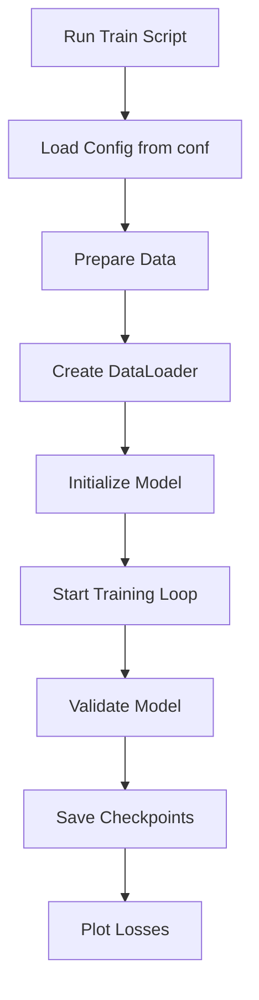
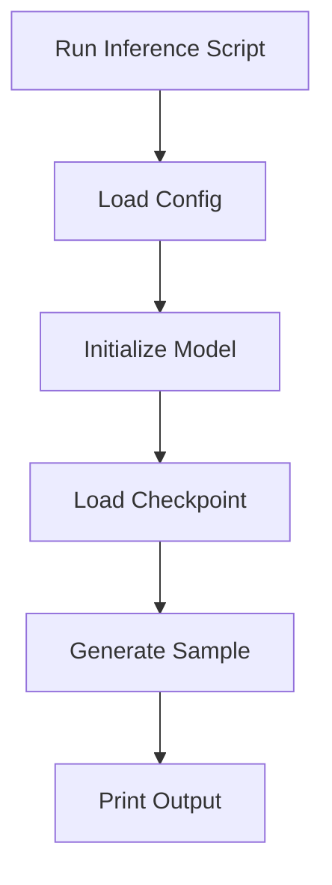

# GPTModel Pipeline 🚀  
A Complete Training and Inference Pipeline for a GPT-like 30 Million Parameter Model using PyTorch

This project provides a robust, modular pipeline to train, checkpoint, and generate text with a GPT-style transformer, utilizing a 400M token dataset. It covers end-to-end processes from data preparation through model training and inference.

---

## 📂 Repository Structure

The repository is organized for clarity, modularity, and scalability. Each component has a dedicated folder to facilitate development and experimentation.

```text
GPT-from-scratch/
├── src/                   # Main source code
│   ├── conf/              # Configuration management (Hydra/OmegaConf)
│   │   ├── config.py      # Configuration parsing logic
│   │   ├── config.yaml    # Main configuration file
│   │   ├── dataset/       # Dataset-specific configs (e.g., laptop/server)
│   │   └── model/         # Model architecture hyperparameters
│   ├── dataset/           # Data loading and preprocessing
│   │   └── dataset.py     # Custom PyTorch Dataset implementation
│   ├── model/             # Transformer architecture implementation
│   │   ├── blocks/        # Modular GPT components
│   │   │   ├── feed_forward.py   # Feed-Forward Network (FFN) layer
│   │   │   ├── layer_norm.py     # Layer Normalization implementation
│   │   │   ├── mha.py            # Multi-Head Attention mechanism
│   │   │   └── transformer.py    # Unified Transformer block
│   │   └── gpt.py         # Final GPT model definition
│   ├── train/             # Core training logic
│   │   └── trainer.py     # Trainer class to manage the training loop
│   ├── metrics/           # Loss, accuracy, and perplexity calculations
│   ├── utils/             # Utility functions and helpers
│   │   ├── optimizer/     # Learning Rate schedulers and optimization
│   │   ├── plotting/      # Loss and Learning Rate visualization
│   │   ├── text_generation/ # Inference logic (Greedy/Top-k sampling)
│   │   └── tiny_stories/  # Specific loader for the TinyStories dataset
│   ├── train.py           # Main script to launch training
│   └── inference.py       # Script for testing the trained model
├── checkpoint/            # (Git-ignored) Model weights storage (Hugging Face)
├── dataset_train.bin      # Pre-tokenized training data
├── makefile               # Shortcuts for setup, training, and cleaning
├── pyproject.toml         # Project metadata and dependency management (uv)
├── uv.lock                # Deterministic lockfile for reproducibility
└── README.md              # Project documentation
```

---

## Installation

Set up your environment and install all dependencies before using the pipeline.

### Requirements

- **Python 3.10+**
- **CUDA-enabled GPU** (Recommended for fast training)
- **`uv`** Python package manager (for lockfile and reproducible installs)
- **GNU `make`** utility (for Makefile commands)

### 1. Clone the Repository

```bash
git clone https://huggingface.co/DanielePio/GPT-From-Scratch-30M
cd GPT-From-Scratch-30M
```

### 2. Install [uv](https://github.com/astral-sh/uv)

`uv` is a fast Python package manager. Install it with:

```bash
pip install uv
```

### 3. Install GNU Make (if not already installed)

#### On Ubuntu/Debian:

```bash
sudo apt-get update
sudo apt-get install make
```

#### On macOS (with Homebrew):

```bash
brew install make
```

#### On Windows:

- Install via [Chocolatey](https://chocolatey.org/packages/make):  
  ```bash
  choco install make
  ```
- Or use WSL (Windows Subsystem for Linux).

### 4. Install Python Dependencies

From the project root, run:

```bash
make install
```

This will use `uv` to install dependencies as defined in `pyproject.toml` and lock them in `uv.lock` for reproducibility.

---

## Configuration

All hyperparameters and file paths are defined in **`src/conf/config.yaml`**. You can override any value through the command line.

| Key                      | Description                                         |
|--------------------------|-----------------------------------------------------|
| `dataset.train_ratio`    | Fraction of tokens to use for training              |
| `dataset.train_shuffle`  | Shuffle training data if true                       |
| `dataset.num_workers`    | Number of DataLoader worker processes               |
| `model.vocab_size`       | Size of the token vocabulary                        |
| `model.embed_dim`        | Dimension of token embeddings                       |
| `model.max_length`       | Maximum sequence length (context size)              |
| `model.micro_batch_size` | Batch size per GPU after grad accumulation          |
| `model.num_heads`        | Number of attention heads                           |
| `model.num_layers`       | Number of transformer blocks                        |
| `model.ffn_dropout_rate` | Dropout rate in feed-forward layers                 |
| `model.mha_dropout_rate` | Dropout rate in multi-head attention                |
| `model.emb_dropout_rate` | Dropout rate on token embeddings                    |
| `model.qkv_bias`         | Use bias in QKV projections if true                 |
| `model.learning_rate`    | Initial learning rate for optimizer                 |
| `model.min_lr`           | Minimum learning rate after decay                   |
| `model.weight_decay`     | Weight decay for AdamW optimizer                    |
| `model.warmup_steps`     | Steps for learning rate warmup                      |
| `model.num_epochs`       | Total number of training epochs                     |
| `model.grad_accumulation`| Mini-batches to accumulate gradients                |
| `model.eval_freq`        | Step frequency to run validation                    |
| `model.eval_iter`        | Number of batches per validation run                |
| `model.prompt`           | Initial text for generation during training         |
| `model.temperature`      | Sampling temperature for text generation            |
| `model.top_k`            | Top-k sampling filter                               |
| `model.top_p`            | Top-p (nucleus) sampling filter                     |
| `model.checkpoint_name`  | Prefix for checkpoint files                         |
| `model.checkpoint_path`  | Directory to save/load checkpoints                  |
| `model.max_new_tokens`   | Tokens to generate in inference                     |

---

## Usage

### Makefile Commands

The Makefile provides concise commands for all major tasks:

- `make install` — Install all Python dependencies.
- `make train` — Launch model training with default config.
- `make inference` — Run text generation with the latest checkpoint.
---

### Data Preparation

You can prepare your data explicitly or let the training script handle it automatically.

```bash
make data
# or
python train.py
```

If `dataset_train.bin` is missing, the script will call `prepare_data()`.

---

### Training

Launch training with default settings:

```bash
make train
```

Or override any configuration value:

```bash
python train.py model.num_epochs=20 model.learning_rate=0.0005
```

- Checkpoints and logs are stored under `outputs/train/...` by Hydra.
- Loss curves are plotted at the end of each run.

---

### Inference

Generate text from a trained model:

```bash
make inference
```

Or customize prompt and output length:

```bash
python inference.py model.prompt="Once upon a time" model.max_new_tokens=100
```

The script prints generated text to the console.

---

## Training Workflow

Below is a visual summary of the model training process:



---

## Inference Workflow

The following diagram illustrates how inference is performed:



---

## File Descriptions

### `train.py`

This is the main entry point for training the GPTModel.

- Loads Hydra configuration.
- Prepares or memory-maps the dataset.
- Splits data into training and validation sets.
- Builds PyTorch DataLoaders.
- Instantiates **GPTModel** and **Trainer** classes.
- Runs the training loop with periodic evaluation.
- Plots training and validation losses.

### `inference.py`

Script to generate text from a trained model.

- Loads Hydra configuration and hyperparameters.
- Builds the **GPTModel** with saved settings.
- Loads the latest model checkpoint.
- Calls `generate_and_print_sample` to produce text output.
- To run a different prompt with the CMD run:
  ```bash
  uv run python src/inference.py model.prompt="Your prompt"
  ```

### `dataset.py`

Handles all dataset preparation and loading.

- `prepare_data()` — Tokenizes raw dataset and produces `dataset_train.bin` for fast loading.
- `create_dataloader_v1()` — Generates sliding-window datasets suitable for GPT-style training.

### `model.py`

Defines the transformer architecture for the GPTModel.

- **GPTModel** — Core model class with token embedding, attention, and feed-forward layers.
- Supports both training forward pass and text sampling/generation.

### `utils.py`

Utility functions for the pipeline.

- `prepare_data()` — Helper to process and tokenize data.
- `plot_losses()` — Plots training and validation loss curves.
- `load_checkpoint()` — Finds and loads the latest saved model checkpoint.
- `generate_and_print_sample()` — Handles text generation and pretty printing.

### `conf/config.yaml`

This YAML file defines all default hyperparameters and paths for both training and inference.  
Override any value in experiments via command-line arguments.

---

## Contributing

We welcome issues and pull requests! Please follow the existing code style and be sure to update the README if your changes require it.

---

## License

This project is licensed under the MIT License. See the [LICENSE](LICENSE) file for details.

---

```card
{
  "title": "Best Practice",
  "content": "Always review and adjust hyperparameters in conf/config.yaml for your hardware and dataset before large-scale training."
}
```

---

```card
{
  "title": "Tip: Fast Setup",
  "content": "Use `make install` for consistent, reproducible dependency setup with uv. Use `make train` to start training immediately."
}
```

---

Happy modeling! 🚀