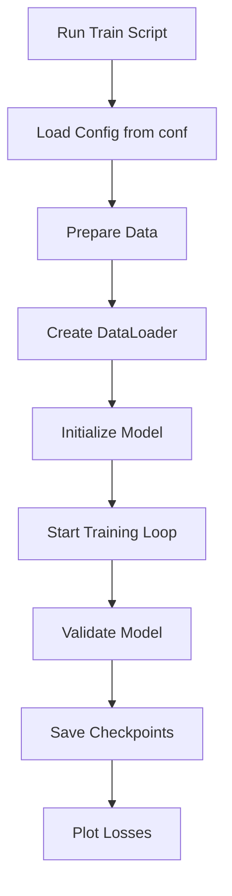
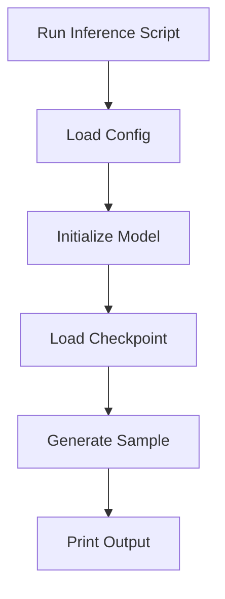

# GPTModel Pipeline 🚀

A complete training and inference pipeline for a GPT-like model using PyTorch and Hydra.  
This project covers data preparation, model training, checkpointing, and text generation.

## Project Structure

The repository follows a clear structure for modularity and ease of use.

- **conf/**  
  - `config.yaml` — Default configuration for dataset, model, and training.
- **dataset.py** — Data preparation and DataLoader creation.
- **model.py** — Definition of the GPTModel architecture.
- **train.py** — Entry point for model training.
- **inference.py** — Script for loading a checkpoint and generating text.
- **utils.py** — Utility functions (data prep, plotting, checkpointing, sampling).
- **Makefile** — Automation for setup, data prep, training, and inference.
- **README.md** — Project documentation.

## Installation

Set up the environment and install dependencies.

```bash
# Clone the repository
git clone https://github.com/yourusername/gptmodel-pipeline.git
cd gptmodel-pipeline

# Install Python dependencies
pip install -r requirements.txt
```

- Python 3.8+ recommended  
- GPU with CUDA support greatly speeds up training  

```card
{
    "title": "GPU Recommended",
    "content": "Training runs fastest on a CUDA-enabled GPU."
}
```

## Configuration

All hyperparameters and file paths reside in **conf/config.yaml**.  
You can override any value via the command line.

| Key                         | Description                                    |
|-----------------------------|------------------------------------------------|
| `dataset.train_ratio`       | Fraction of tokens to use for training.        |
| `dataset.train_shuffle`     | Shuffle training data if true.                 |
| `dataset.num_workers`       | Number of DataLoader worker processes.         |
| `model.vocab_size`          | Size of the token vocabulary.                  |
| `model.embed_dim`           | Dimension of token embeddings.                 |
| `model.max_length`          | Maximum sequence length (context size).        |
| `model.micro_batch_size`    | Batch size per GPU after gradient accumulation.|
| `model.num_heads`           | Number of attention heads.                     |
| `model.num_layers`          | Number of transformer blocks.                  |
| `model.ffn_dropout_rate`    | Dropout rate in feed-forward layers.           |
| `model.mha_dropout_rate`    | Dropout rate in multi-head attention.          |
| `model.emb_dropout_rate`    | Dropout rate on token embeddings.              |
| `model.qkv_bias`            | Use bias in QKV projections if true.           |
| `model.learning_rate`       | Initial learning rate for optimizer.           |
| `model.min_lr`              | Minimum learning rate after decay.             |
| `model.weight_decay`        | Weight decay for AdamW.                        |
| `model.warmup_steps`        | Steps for learning rate warmup.                |
| `model.num_epochs`          | Total number of training epochs.               |
| `model.grad_accumulation`   | Number of mini-batches to accumulate grads.    |
| `model.eval_freq`           | Frequency (in steps) to run validation.        |
| `model.eval_iter`           | Number of batches per validation run.          |
| `model.prompt`              | Initial text for generation during training.   |
| `model.temperature`         | Sampling temperature for text generation.      |
| `model.top_k`               | Top-k sampling filter.                         |
| `model.top_p`               | Top-p (nucleus) sampling filter.               |
| `model.checkpoint_name`     | Prefix for checkpoint files.                   |
| `model.checkpoint_path`     | Directory to save/load checkpoints.            |
| `model.max_new_tokens`      | Tokens to generate in inference.               |

## Usage

### Makefile Commands

Use the Makefile for streamlined commands.

- `make install`  
  Install dependencies via `pip`.
- `make data`  
  Prepare the binary dataset (`dataset_train.bin`).
- `make train`  
  Launch training with default config.
- `make inference`  
  Run text generation using the latest checkpoint.
- `make clean`  
  Remove generated files and outputs.

### Data Preparation

You can prepare data explicitly or let training handle it.

```bash
make data
# or
python train.py
```

The script will call `prepare_data()` if `dataset_train.bin` is missing.

### Training

Launch training with default settings:

```bash
make train
```

Or override any config:

```bash
python train.py model.num_epochs=20 model.learning_rate=0.0005
```

- Checkpoints and logs appear under `outputs/train/...` by Hydra.  
- Loss curves are plotted at the end.

### Inference

Generate text from a trained model:

```bash
make inference
```

Or customize prompt and length:

```bash
python inference.py model.prompt="Once upon a time" model.max_new_tokens=100
```

Outputs print generated text to console.

## Training Workflow

Visual overview of the training process.



## Inference Workflow

Steps for loading a checkpoint and generating text.



## File Descriptions

### train.py

Entry point to train the GPTModel.  

- Loads Hydra config.  
- Prepares or memory-maps the dataset.  
- Splits into training and validation.  
- Builds PyTorch DataLoaders.  
- Instantiates **GPTModel** and **Trainer**.  
- Runs the training loop with evaluation.  
- Plots training and validation losses.

### inference.py

Script to generate text from a saved model.  

- Loads Hydra config.  
- Builds **GPTModel** with saved hyperparameters.  
- Finds and loads the latest checkpoint.  
- Calls `generate_and_print_sample` to produce text.

### dataset.py

Utilities for data handling.  

- `prepare_data()` — Tokenizes raw text and writes `dataset_train.bin`.  
- `create_dataloader_v1()` — Creates sliding-window datasets for GPT.

### model.py

Defines the transformer architecture.  

- **GPTModel** class with embedding, attention, and feed-forward layers.  
- Supports forward pass and sampling methods.

### utils.py

Helper functions:  

- `prepare_data()` — Raw data tokenization.  
- `plot_losses()` — Visualize loss curves.  
- `load_checkpoint()` — Locate latest model checkpoint.  
- `generate_and_print_sample()` — Text generation and display.

### conf/config.yaml

Default values for all training and inference parameters.  
Use CLI overrides to tweak behavior per experiment.

## Contributing

We welcome issues and pull requests.  
Please follow the existing code style and update this README as needed.

## License

This project is licensed under the MIT License.  
See the [LICENSE](LICENSE) file for details.